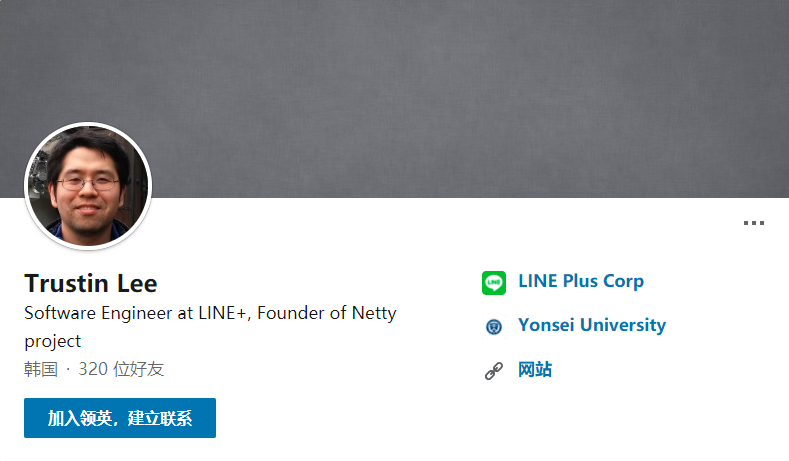
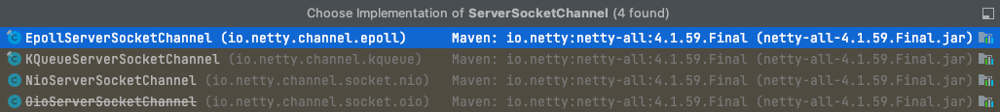
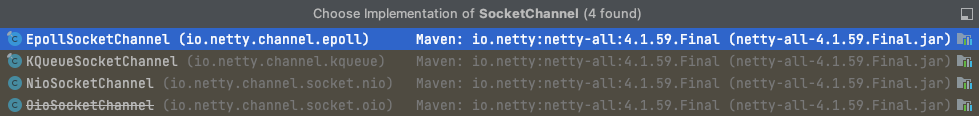
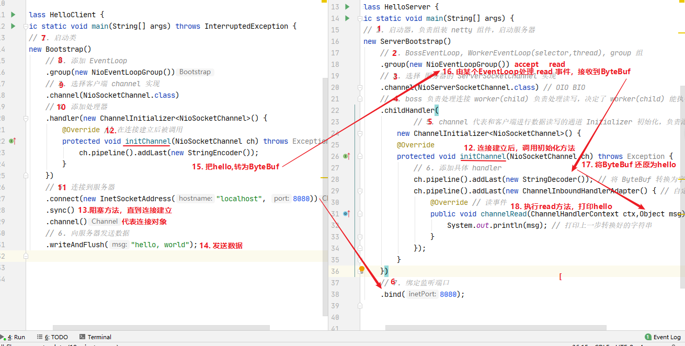
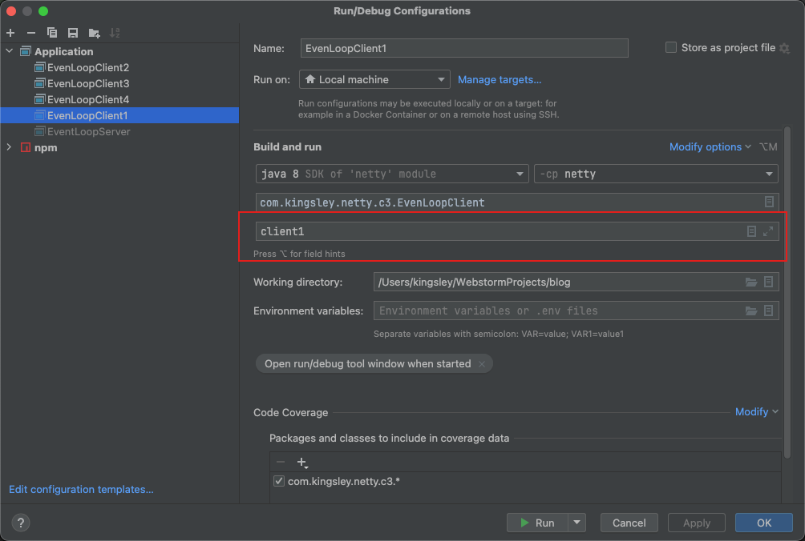

# Netty入门

## 一、概述

### 1、Netty 是什么？

> Netty is an asynchronous event-driven network application framework for rapid development of maintainable high performance protocol servers & clients.

Netty 是一个**异步**的、**基于事件驱动**的**网络应用框架**，用于快速开发可维护、高性能的网络服务器和客户端。
> 底层基于 NIO ，所以 Netty 运行在 JVM 上。

### 2、Netty 的作者



他还是另一个著名的高性能 Java 网络框架 [Mina](https://mina.apache.org/mina-project/quick-start-guide.html) 的重要贡献者

### 3、Netty 的地位

Netty 在 Java 网络应用框架中的地位就好比：Spring 框架在 JavaEE 开发中的地位

以下的框架都使用了 Netty，因为它们有网络通信需求！

- Cassandra - nosql 数据库
- Spark - 大数据分布式计算框架
- Hadoop - 大数据分布式存储框架
- RocketMQ - ali 开源的消息队列
- ElasticSearch - 搜索引擎
- gRPC - rpc 框架
- Dubbo - rpc 框架
- Spring 5.x - flux api 完全抛弃了 tomcat ，使用 netty 作为服务器端
- Zookeeper - 分布式协调框架

### 4、Netty 的优势

- Netty vs NIO，工作量大，bug 多
    - 需要自己构建协议
    - 解决 TCP 传输问题，如粘包、半包
    - epoll 空轮询导致 CPU 100%
    - 对 API 进行增强，使之更易用，如 FastThreadLocal => ThreadLocal，ByteBuf => ByteBuffer
- Netty vs 其它网络应用框架
    - Mina 由 apache 维护，将来 3.x 版本可能会有较大重构，破坏 API 向下兼容性，Netty 的开发迭代更迅速，API 更简洁、文档更优秀
    - 久经考验，16年，Netty 版本
        - 2.x 2004
        - 3.x 2008
        - 4.x 2013
        - 5.x 已废弃（没有明显的性能提升，维护成本高）

## 二、快速入门

### 1、目标

开发一个简单的服务器端和客户端

- 客户端向服务器端发送 hello, world
- 服务器仅接收，不返回

加入依赖

```xml

<dependency>
    <groupId>io.netty</groupId>
    <artifactId>netty-all</artifactId>
    <version>4.1.59.Final</version>
</dependency>
```

### 2、服务器端

```java
import io.netty.bootstrap.ServerBootstrap;
import io.netty.channel.ChannelHandlerContext;
import io.netty.channel.ChannelInboundHandlerAdapter;
import io.netty.channel.ChannelInitializer;
import io.netty.channel.nio.NioEventLoopGroup;
import io.netty.channel.socket.nio.NioServerSocketChannel;
import io.netty.channel.socket.nio.NioSocketChannel;
import io.netty.handler.codec.string.StringDecoder;

/**
 * netty服务端
 *
 * @author kingsley
 * @date 2024/4/7 21:41
 */
public class HelloServer {

    public static void main(String[] args) {
        // 1、启动器，负责组装netty组件，启动服务器
        new ServerBootstrap()
                /*
                 * 2、创建 NioEventLoopGroup，可以简单理解为 BossEventLoop 和 WorkerEventLoop(selector, thread)
                 * NioEventLoopGroup 包含 BossEventLoop 和 WorkerEventLoop，可简单理解为NIO基础中学到的 Boss 和 Worker
                 * WorkerEventLoop中有最重要的两部分：selector，线程。
                 *  - selector：用于监听客户端连接、处理网络事件（可读、可写）；
                 *  - thread：处理具体的网络事件，充分利用CPU
                 */
                .group(new NioEventLoopGroup())
                /*
                 * 3、选择服务器的ServerSocketChannel实现
                 *  - NioServerSocketChannel：NIO
                 *  - OioServerSocketChannel：BIO
                 * 在启动时会反射调用NioServerSocketChannel的构造方法，创建对象
                 */
                .channel(NioServerSocketChannel.class)
                /*
                 * 4、boss负责处理连接，worker（child）负责处理读写，决定了worker能执行哪些操作（handler）
                 */
                .childHandler(
                        /*
                         * 5、添加和客户端进行数据读写的通道的初始化器，它本身是一个特殊的handler，它的作用是管理一系列的handler，可以理解为拦截器
                         * 该方法不会立即执行初始化操作，而是等待连接建立后才会执行初始化
                         */
                        new ChannelInitializer<NioSocketChannel>() {
                            @Override
                            protected void initChannel(NioSocketChannel ch) {
                                /*
                                 * 6、添加具体的handler
                                 *  - StringDecoder：将接收到的ByteBuf转换为字符串
                                 *  - ChannelInboundHandlerAdapter：自定义handler
                                 */
                                ch.pipeline().addLast(new StringDecoder());
                                ch.pipeline().addLast(new ChannelInboundHandlerAdapter() {
                                    /*
                                     * 7、channelRead处理读事件
                                     */
                                    @Override
                                    public void channelRead(ChannelHandlerContext ctx, Object msg) {
                                        /*
                                         * 8、接收到消息并处理，这里打印上一步转换好的字符串
                                         */
                                        System.out.println("收到的消息：" + msg);
                                    }
                                });
                            }
                        })
                /*
                 * 9、绑定监听端口并启动服务器
                 */
                .bind(8080);
    }

}
```

#### 代码解读

- 2处，创建 NioEventLoopGroup，可以简单理解为 线程池 + Selector 后面会详细展开
- 3处，选择服务 Scoket 实现类，其中 NioServerSocketChannel 表示基于 NIO 的服务器端实现，其它实现还有
  
- 4处，为啥方法叫 childHandler，是接下来添加的处理器都是给 SocketChannel 用的，而不是给 ServerSocketChannel。ChannelInitializer 处理器（仅执行一次），它的作用是待客户端
  SocketChannel 建立连接后，执行 initChannel 以便添加更多的处理器
- 6处，SocketChannel 的处理器，解码 ByteBuf => String
- 7处，SocketChannel 的业务处理器，使用上一个处理器的处理结果

### 3、客户端

```java
import io.netty.bootstrap.Bootstrap;
import io.netty.channel.ChannelInitializer;
import io.netty.channel.nio.NioEventLoopGroup;
import io.netty.channel.socket.nio.NioSocketChannel;
import io.netty.handler.codec.string.StringEncoder;

/**
 * netty客户端
 * @author kingsley
 * @date 2024/4/7 22:02
 */
public class HelloClient {

    public static void main(String[] args) throws InterruptedException {
        // 1、创建客户端启动对象
        new Bootstrap()
                // 2、添加EventLoop
                .group(new NioEventLoopGroup())
                // 3、选择客户端channel实现类
                .channel(NioSocketChannel.class)
                // 4、添加处理器
                .handler(new ChannelInitializer<NioSocketChannel>() {
                    // 初始化channel，在连接成功之后调用
                    @Override
                    protected void initChannel(NioSocketChannel ch) {
                        // 5、往pipeline链中添加一个handler处理器，这里使用 StringEncoder 将字符串编码成 ByteBuf
                        ch.pipeline().addLast(new StringEncoder());
                    }
                })
                // 6、启动客户端连接服务器，等待连接成功
                .connect("127.0.0.1", 8080)
                // 7、阻塞方法，等待连接成功
                .sync()
                // 8、代表连接对象，可以理解为通道，通过该对象可以发送消息给服务器
                .channel()
                // 9、向服务器发送数据
                .writeAndFlush("hello, netty");
    }

}
```

#### 代码解读

- 2处，创建 NioEventLoopGroup，同 Server
- 3处，选择客户端 Socket 实现类，NioSocketChannel 表示基于 NIO 的客户端实现，其它实现还有
  
- 4处，添加 SocketChannel 的处理器，ChannelInitializer 处理器（仅执行一次），它的作用是待客户端 SocketChannel 建立连接后，执行 initChannel 以便添加更多的处理器
- 5处，消息会经过通道 handler 处理，这里是将 String => ByteBuf 发出
- 6处，启动客户端连接服务器，等待连接成功
- 7处，Netty 中很多方法都是异步的，如 connect，这时需要使用 sync 方法等待 connect 建立连接完毕
- 8处，获取 channel 对象，它即为通道抽象，可以进行数据读写操作
- 9处，写入消息并清空缓冲区

### 4、流程梳理



💡 提示
> **一开始需要树立正确的观念**
> * 把 channel 理解为数据的通道
> * 把 msg 理解为流动的数据，最开始输入是 ByteBuf，但经过 pipeline 的加工，会变成其它类型对象，最后输出又变成 ByteBuf
> * 把 handler 理解为数据的处理工序
    >

* 工序有多道，合在一起就是 pipeline，pipeline 负责发布事件（读、读取完成...）传播给每个 handler， handler 对自己感兴趣的事件进行处理（重写了相应事件处理方法）

> * handler 分 Inbound 和 Outbound 两类
> * 把 eventLoop 理解为处理数据的工人
    >

* 工人可以管理多个 channel 的 IO 操作，并且一旦工人负责了某个 channel，就要负责到底（绑定），目的是为了线程安全。
  > 总结起来就说是：**一个 eventLoop 只负责一个 NioEventLoopGroup 中的一个线程，这个线程可以管理多个 channel，但一个 channel 只能由一个 eventLoop 管理**

> * 工人既可以执行 IO 操作，也可以进行任务处理，每位工人有任务队列，队列里可以堆放多个 channel 的待处理任务，任务分为普通任务、定时任务
    >

* 工人按照 pipeline 顺序，依次按照 handler 的规划（代码）处理数据，可以为每道工序指定不同的工人

## 三、组件

### 1、EventLoop

事件循环对象，本质是一个单线程执行器（同时维护了一个 Selector），里面有 run 方法处理 Channel 上源源不断的 IO 事件。

```java
package io.netty.channel;

import io.netty.util.concurrent.OrderedEventExecutor;

/**
 * Will handle all the I/O operations for a {@link io.netty.channel.Channel} once registered.
 * One {@link EventLoop} instance will usually handle more than one {@link io.netty.channel.Channel} but this may depend on
 * implementation details and internals.
 *
 */
@SuppressWarnings("all")
public interface EventLoop extends OrderedEventExecutor, EventLoopGroup {
    @Override
    EventLoopGroup parent();
}
```

它的继承关系比较复杂

- 一条线是继承自 java.util.concurrent.ScheduledExecutorService，因此包含了线程池中所有的方法
- 另一条线是继承自 netty 自己的 OrderedEventExecutor
    - 提供了 boolean inEventLoop(Thread thread) 方法判断一个线程是否属于此 EventLoop
    - 提供了 parent 方法来看看自己属于哪个 EventLoopGroup

### 2、EventLoopGroup

事件循环组，是一组 EventLoop。Channel 一般会调用 EventLoopGroup 的 register 方法来绑定其中一个 EventLoop，后续这个 Channel 上的 IO 事件都由此 EventLoop 来处理（保证了
IO 事件处理时的线程安全）

- 继承自 netty 自己的 EventExecutorGroup
    - 实现了 Iterable 接口提供遍历 EventLoop 的能力
    - 另有 next 方法获取集合中下一个 EventLoop

以一个简单的实现为例：

<CodeGroup>
  <CodeGroupItem title="客户端">

```java
package com.kingsley.netty.c2;

import io.netty.channel.EventLoopGroup;
import io.netty.channel.nio.NioEventLoopGroup;
import io.netty.util.concurrent.EventExecutor;
import lombok.extern.slf4j.Slf4j;

import java.util.concurrent.TimeUnit;

/**
 * EventLoop测试
 *
 * @author kingsley
 * @date 2024/4/7 23:46
 */
@Slf4j
public class TestEventLoop {

    public static void main(String[] args) throws InterruptedException {
        /*
         * 1、创建事件循环组，这里设置2个线程，2个线程就是2个EventLoop
         * NioEventLoopGroup：可处理IO事件、普通任务、定时任务
         * DefaultEventLoopGroup：处理普通任务、定时任务
         */
        EventLoopGroup group = new NioEventLoopGroup(2);
        // 2、获取下一个事件循环对象
        log.info("EventLoop: {}", group.next());
        log.info("EventLoop: {}", group.next());
        log.info("EventLoop: {}", group.next());
        log.info("---------");
        // 也可以使用 for 循环
        for (EventExecutor eventLoop : group) {
            log.info("EventLoop: {}", eventLoop);
        }

        // 处理普通任务
        group.next().execute(() -> {
            try {
                Thread.sleep(1000);
            } catch (InterruptedException e) {
                e.printStackTrace();
            }
            log.info("执行普通任务");
        });

        // 处理定时任务
        group.next().schedule(() -> {
            log.info("执行定时任务1");
        }, 10, TimeUnit.MILLISECONDS);
        group.next().schedule(() -> {
            log.info("执行定时任务2");
        }, 10, TimeUnit.MILLISECONDS);

        // 阻塞主线程
        TimeUnit.MILLISECONDS.sleep(200);

        // 3、优雅的关闭
        group.shutdownGracefully();

        log.info("main");
    }

}
```

  </CodeGroupItem>

  <CodeGroupItem title="输出">

```shell
2024-04-08 00:09:05.465 INFO  [main] com.kingsley.netty.c2.TestEventLoop               : EventLoop: io.netty.channel.nio.NioEventLoop@28feb3fa
2024-04-08 00:09:05.465 INFO  [main] com.kingsley.netty.c2.TestEventLoop               : EventLoop: io.netty.channel.nio.NioEventLoop@675d3402
2024-04-08 00:09:05.465 INFO  [main] com.kingsley.netty.c2.TestEventLoop               : EventLoop: io.netty.channel.nio.NioEventLoop@28feb3fa
2024-04-08 00:09:05.465 INFO  [main] com.kingsley.netty.c2.TestEventLoop               : ---------
2024-04-08 00:09:05.465 INFO  [main] com.kingsley.netty.c2.TestEventLoop               : EventLoop: io.netty.channel.nio.NioEventLoop@28feb3fa
2024-04-08 00:09:05.465 INFO  [main] com.kingsley.netty.c2.TestEventLoop               : EventLoop: io.netty.channel.nio.NioEventLoop@675d3402
2024-04-08 00:09:05.551 INFO  [nioEventLoopGroup-2-2] com.kingsley.netty.c2.TestEventLoop               : 执行定时任务1
2024-04-08 00:09:05.741 INFO  [main] com.kingsley.netty.c2.TestEventLoop               : main
2024-04-08 00:09:06.545 INFO  [nioEventLoopGroup-2-1] com.kingsley.netty.c2.TestEventLoop               : 执行普通任务
2024-04-08 00:09:06.546 INFO  [nioEventLoopGroup-2-1] com.kingsley.netty.c2.TestEventLoop               : 执行定时任务2
```

  </CodeGroupItem>
</CodeGroup>

#### 💡 优雅关闭

优雅关闭 shutdownGracefully 方法。该方法会首先切换 EventLoopGroup 到关闭状态从而拒绝新的任务的加入，然后在任务队列的任务都处理完成后，停止线程的运行。从而确保整体应用是在正常有序的状态下退出的

#### NioEventLoop 处理 io 事件

服务器端两个 nio worker 工人，配置四个客户端，通过命令行参数设置客户端ID，然后快速依次启动




<CodeGroup>
<CodeGroupItem title="服务端">

```java
package com.kingsley.netty.c3;

import io.netty.bootstrap.ServerBootstrap;
import io.netty.buffer.ByteBuf;
import io.netty.channel.ChannelHandlerContext;
import io.netty.channel.ChannelInboundHandlerAdapter;
import io.netty.channel.ChannelInitializer;
import io.netty.channel.nio.NioEventLoopGroup;
import io.netty.channel.socket.nio.NioServerSocketChannel;
import io.netty.channel.socket.nio.NioSocketChannel;
import lombok.extern.slf4j.Slf4j;

import java.nio.charset.Charset;

/**
 * @author kingsley
 * @date 2024/4/17 22:43
 */
@Slf4j
public class EventLoopServer {

    /**
     * 主程序入口。
     * 使用ServerBootstrap启动一个服务器，配置使用NIO传输，绑定到8080端口。
     * 对每个新连接，使用ChannelInitializer初始化Channel，加入自定义的ChannelInboundHandlerAdapter以处理入站事件。
     */
    public static void main(String[] args) {
        new ServerBootstrap() // 创建ServerBootstrap实例，用于启动服务器
                .group(new NioEventLoopGroup(1), new NioEventLoopGroup(2)) // 指定使用NIO事件循环组
                .channel(NioServerSocketChannel.class) // 指定使用NIO服务器套接字通道
                .childHandler(new ChannelInitializer<NioSocketChannel>() { // 定义子通道（即每个新连接）的初始化处理器
                    @Override
                    protected void initChannel(NioSocketChannel ch) throws Exception {
                        ch.pipeline().addLast(new ChannelInboundHandlerAdapter() { // 向通道处理链中添加自定义的入站事件处理器
                            @Override
                            public void channelRead(ChannelHandlerContext ctx, Object msg) { // 当有数据读取时
                                ByteBuf buf = (ByteBuf) msg; // 将接收到的消息转换为ByteBuf类型
                                log.info("receive: {}", buf.toString(Charset.defaultCharset())); // 打印接收到的数据
                            }
                        });
                    }
                }).bind(8080); // 绑定到8080端口并启动服务器
    }

}
```

</CodeGroupItem>
<CodeGroupItem title="客户端">

```java
package com.kingsley.netty.c3;

import io.netty.bootstrap.Bootstrap;
import io.netty.channel.Channel;
import io.netty.channel.ChannelInitializer;
import io.netty.channel.nio.NioEventLoopGroup;
import io.netty.channel.socket.nio.NioSocketChannel;
import io.netty.handler.codec.string.StringEncoder;
import lombok.extern.slf4j.Slf4j;

import java.util.Arrays;

/**
 * netty客户端
 *
 * @author kingsley
 * @date 2024/4/7 22:02
 */
@Slf4j
public class EventLoopClient {

    public static void main(String[] args) throws InterruptedException {
        // 1、创建客户端启动对象
        Channel channel = new Bootstrap()
                // 2、添加EventLoop
                .group(new NioEventLoopGroup())
                // 3、选择客户端channel实现类
                .channel(NioSocketChannel.class)
                // 4、添加处理器
                .handler(new ChannelInitializer<NioSocketChannel>() {
                    // 初始化channel，在连接成功之后调用
                    @Override
                    protected void initChannel(NioSocketChannel ch) {
                        // 5、往pipeline链中添加一个handler处理器，这里使用 StringEncoder 将字符串编码成 ByteBuf
                        ch.pipeline().addLast(new StringEncoder());
                    }
                })
                // 6、启动客户端连接服务器，等待连接成功
                .connect("127.0.0.1", 8080)
                // 阻塞方法，等待连接成功
                .sync()
                // 代表连接对象
                .channel();
        String clientId = args[0];
        log.info("客户端连接成功，channel: {}, clientId: {}", channel, clientId);
        // 7、向服务器发送数据
        channel.writeAndFlush(clientId + " ===> hello, netty1");
        Thread.sleep(10000);
        channel.writeAndFlush(clientId + "hello, netty2");
    }
}
```

</CodeGroupItem>

<CodeGroupItem title="输出">

```shell
2024-04-17 23:55:39.875 DEBUG [nioEventLoopGroup-3-1] io.netty.util.Recycler                            : -Dio.netty.recycler.maxCapacityPerThread: 4096
2024-04-17 23:55:39.876 DEBUG [nioEventLoopGroup-3-1] io.netty.util.Recycler                            : -Dio.netty.recycler.maxSharedCapacityFactor: 2
2024-04-17 23:55:39.876 DEBUG [nioEventLoopGroup-3-1] io.netty.util.Recycler                            : -Dio.netty.recycler.linkCapacity: 16
2024-04-17 23:55:39.876 DEBUG [nioEventLoopGroup-3-1] io.netty.util.Recycler                            : -Dio.netty.recycler.ratio: 8
2024-04-17 23:55:39.876 DEBUG [nioEventLoopGroup-3-1] io.netty.util.Recycler                            : -Dio.netty.recycler.delayedQueue.ratio: 8
2024-04-17 23:55:39.889 DEBUG [nioEventLoopGroup-3-1] io.netty.buffer.AbstractByteBuf                   : -Dio.netty.buffer.checkAccessible: true
2024-04-17 23:55:39.890 DEBUG [nioEventLoopGroup-3-1] io.netty.buffer.AbstractByteBuf                   : -Dio.netty.buffer.checkBounds: true
2024-04-17 23:55:39.893 DEBUG [nioEventLoopGroup-3-1] io.netty.util.ResourceLeakDetectorFactory         : Loaded default ResourceLeakDetector: io.netty.util.ResourceLeakDetector@452b789e
2024-04-17 23:55:39.899 INFO  [nioEventLoopGroup-3-1] com.kingsley.netty.c3.EventLoopServer             : receive: client2 ===> hello, netty1
2024-04-17 23:55:40.430 INFO  [nioEventLoopGroup-3-2] com.kingsley.netty.c3.EventLoopServer             : receive: client3 ===> hello, netty1
2024-04-17 23:55:41.053 INFO  [nioEventLoopGroup-3-1] com.kingsley.netty.c3.EventLoopServer             : receive: client4 ===> hello, netty1
2024-04-17 23:55:41.603 INFO  [nioEventLoopGroup-3-2] com.kingsley.netty.c3.EventLoopServer             : receive: client1 ===> hello, netty1
2024-04-17 23:55:49.858 INFO  [nioEventLoopGroup-3-1] com.kingsley.netty.c3.EventLoopServer             : receive: client2 ===> hello, netty2
2024-04-17 23:55:50.419 INFO  [nioEventLoopGroup-3-2] com.kingsley.netty.c3.EventLoopServer             : receive: client3 ===> hello, netty2
2024-04-17 23:55:51.045 INFO  [nioEventLoopGroup-3-1] com.kingsley.netty.c3.EventLoopServer             : receive: client4 ===> hello, netty2
2024-04-17 23:55:51.599 INFO  [nioEventLoopGroup-3-2] com.kingsley.netty.c3.EventLoopServer             : receive: client1 ===> hello, netty2
```

</CodeGroupItem>

</CodeGroup>

> - 从前四个读事件日志可以看出，服务端依次使用 nioEventLoopGroup-3-1、nioEventLoopGroup-3-2 线程处理客户端的请求。证明一个线程(EventLoop)
    可以处理多个客户端的请求，并且是通过轮询的方式获取线程(EventLoop)来处理客户端的请求
> - 根据后四次读事件日志可以看出，对于同一个客户端连接通道，服务端使用相同的线程(EventLoop)处理请求


#### ❓上述服务端的代码是否存在问题呢？

由于服务端的一个线程可能要处理多个客户端的请求，如果某一个客户端的请求处理时间过长，那么服务端线程就会阻塞，导致其他客户端的请求无法处理。这种情况下服务端的吞吐量就会因为一个客户端的影响而下降。

💡 解决方案

创建一个独立的 EventLoopGroup 专门处理业务逻辑

```java
package com.kingsley.netty.c3;

import io.netty.bootstrap.ServerBootstrap;
import io.netty.buffer.ByteBuf;
import io.netty.channel.*;
import io.netty.channel.nio.NioEventLoopGroup;
import io.netty.channel.socket.nio.NioServerSocketChannel;
import io.netty.channel.socket.nio.NioSocketChannel;
import lombok.extern.slf4j.Slf4j;

import java.nio.charset.Charset;

/**
 * @author kingsley
 * @date 2024/4/17 22:43
 */
@Slf4j
public class EventLoopServer2 {

    /**
     * 主程序入口。
     * 使用ServerBootstrap启动一个服务器，配置使用NIO传输，绑定到8080端口。
     * 对每个新连接，使用ChannelInitializer初始化Channel，加入自定义的ChannelInboundHandlerAdapter以处理入站事件。
     */
    public static void main(String[] args) {
        // 创建一个独立的 EventLoopGroup
        EventLoopGroup group = new DefaultEventLoopGroup();
        new ServerBootstrap()
                .group(new NioEventLoopGroup(1), new NioEventLoopGroup(2))
                .channel(NioServerSocketChannel.class)
                .childHandler(new ChannelInitializer<NioSocketChannel>() {
                    @Override
                    protected void initChannel(NioSocketChannel ch) {
                        ch.pipeline()
                                // 使用 NioEventLoopGroup 处理
                                .addLast(new ChannelInboundHandlerAdapter() {
                                    @Override
                                    public void channelRead(ChannelHandlerContext ctx, Object msg) {
                                        ByteBuf buf = (ByteBuf) msg;
                                        log.info("receive: {}", buf.toString(Charset.defaultCharset()));
                                        // 将消息传递到下一个 handler 处理，必须加这一行代码 ！！！ 否则在这就断了，不会将消息交给后续 handler 处理
                                        ctx.fireChannelRead(msg);
                                    }
                                })
                                // 使用 DefaultEventLoop 处理
                                .addLast(group, "handler2", new ChannelInboundHandlerAdapter() {
                                    @Override
                                    public void channelRead(ChannelHandlerContext ctx, Object msg) {
                                        ByteBuf buf = (ByteBuf) msg; // 将接收到的消息转换为ByteBuf类型
                                        log.info("handler2 use defaultEventLoop process receive: {}", buf.toString(Charset.defaultCharset()));
                                    }
                                });
                    }
                }).bind(8080);
    }

}
```

先启动服务端，然后同时启动客户端1、客户端2，服务端输出：

```shell
2024-04-18 00:28:42.995 INFO  [nioEventLoopGroup-4-1] com.kingsley.netty.c3.EventLoopServer2            : receive: client2 ===> hello, netty1
2024-04-18 00:28:42.996 INFO  [defaultEventLoopGroup-2-1] com.kingsley.netty.c3.EventLoopServer2            : handler2 use defaultEventLoop process receive: client2 ===> hello, netty1
2024-04-18 00:28:43.585 INFO  [nioEventLoopGroup-4-2] com.kingsley.netty.c3.EventLoopServer2            : receive: client1 ===> hello, netty1
2024-04-18 00:28:43.586 INFO  [defaultEventLoopGroup-2-2] com.kingsley.netty.c3.EventLoopServer2            : handler2 use defaultEventLoop process receive: client1 ===> hello, netty1
2024-04-18 00:28:52.970 INFO  [nioEventLoopGroup-4-1] com.kingsley.netty.c3.EventLoopServer2            : receive: client2 ===> hello, netty2
2024-04-18 00:28:52.972 INFO  [defaultEventLoopGroup-2-1] com.kingsley.netty.c3.EventLoopServer2            : handler2 use defaultEventLoop process receive: client2 ===> hello, netty2
2024-04-18 00:28:53.580 INFO  [nioEventLoopGroup-4-2] com.kingsley.netty.c3.EventLoopServer2            : receive: client1 ===> hello, netty2
2024-04-18 00:28:53.583 INFO  [defaultEventLoopGroup-2-2] com.kingsley.netty.c3.EventLoopServer2            : handler2 use defaultEventLoop process receive: client1 ===> hello, netty2
```

可以发现第二个handler使用的是 defaultEventLoopGroup，并且也是轮询绑定机制


#### 💡 handler 执行中如何换线程（EventLoopGroup）处理？

关键代码

<Badge type="warning" text="io.netty.channel.AbstractChannelHandlerContext#invokeChannelRead()" vertical="middle" />

```java
static void invokeChannelRead(final AbstractChannelHandlerContext next, Object msg) {
    final Object m = next.pipeline.touch(ObjectUtil.checkNotNull(msg, "msg"), next);
    EventExecutor executor = next.executor();
    // 下一个 handler 的事件循环是否与当前的事件循环是同一个线程
    if (executor.inEventLoop()) {
        // 是，直接调用
        next.invokeChannelRead(m);
    } else {
        // 不是，将要执行的代码作为任务提交给下一个事件循环处理（换人）
        executor.execute(new Runnable() {
            @Override
            public void run() {
                next.invokeChannelRead(m);
            }
        });
    }
}
```

- 如果两个 handler 绑定的是同一个线程，那么就直接调用
- 否则，把要调用的代码封装为一个任务对象，由下一个 handler 的线程来调用

### 3、Channel

channel 的主要作用

- close() 可以用来关闭 channel
- closeFuture() 用来处理 channel 的关闭
    - sync 方法作用是同步等待 channel 关闭
    - 而 addListener 方法是异步等待 channel 关闭
- pipeline() 方法添加处理器
- write() 方法将数据写入
- writeAndFlush() 方法将数据写入并刷出

#### ChannelFuture

将之前的客户端代码拆开来看

```java

@Slf4j
public class EventLoopClient {
    public static void main(String[] args) throws InterruptedException {
        ChannelFuture channelFuture = new Bootstrap()
                .group(new NioEventLoopGroup())
                .channel(NioSocketChannel.class)
                .handler(new ChannelInitializer<NioSocketChannel>() {
                    @Override
                    protected void initChannel(NioSocketChannel ch) {
                        ch.pipeline().addLast(new StringEncoder());
                    }
                })
                .connect("127.0.0.1", 8080); // 1

        channelFuture.sync().channel().writeAndFlush(new Date() + ": hello netty!");
    }
}
```

> 1 处返回的是 ChannelFuture 对象，它的作用是利用 channel() 方法来获取 Channel 对象

**注意** connect 方法是异步的，意味着不等连接建立，方法执行就返回了。因此 channelFuture 对象中不能【立刻】获得到正确的 Channel 对象

**验证代码**

<CodeGroup>
<CodeGroupItem title="客户端">

```java

@Slf4j
public class ChannelFutureClient {
    public static void main(String[] args) {
        ChannelFuture channelFuture = new Bootstrap()
                .group(new NioEventLoopGroup())
                .channel(NioSocketChannel.class)
                .handler(new ChannelInitializer<Channel>() {
                    @Override
                    protected void initChannel(Channel ch) {
                        ch.pipeline().addLast(new StringEncoder());
                    }
                })
                .connect("127.0.0.1", 8080);

        System.out.println(channelFuture.channel()); // 1
        channelFuture.sync(); // 2
        System.out.println(channelFuture.channel()); // 3
    }
}
```

</CodeGroupItem>

<CodeGroupItem title="服务端">

```java
package com.kingsley.netty.c3;

import io.netty.bootstrap.ServerBootstrap;
import io.netty.buffer.ByteBuf;
import io.netty.channel.ChannelHandlerContext;
import io.netty.channel.ChannelInboundHandlerAdapter;
import io.netty.channel.ChannelInitializer;
import io.netty.channel.nio.NioEventLoopGroup;
import io.netty.channel.socket.nio.NioServerSocketChannel;
import io.netty.channel.socket.nio.NioSocketChannel;
import lombok.extern.slf4j.Slf4j;

import java.nio.charset.Charset;

/**
 * @author kingsley
 * @date 2024/4/17 22:43
 */
@Slf4j
public class EventLoopServer {

    /**
     * 主程序入口。
     * 使用ServerBootstrap启动一个服务器，配置使用NIO传输，绑定到8080端口。
     * 对每个新连接，使用ChannelInitializer初始化Channel，加入自定义的ChannelInboundHandlerAdapter以处理入站事件。
     */
    public static void main(String[] args) {
        new ServerBootstrap() // 创建ServerBootstrap实例，用于启动服务器
                .group(new NioEventLoopGroup(1), new NioEventLoopGroup(2)) // 指定使用NIO事件循环组
                .channel(NioServerSocketChannel.class) // 指定使用NIO服务器套接字通道
                .childHandler(new ChannelInitializer<NioSocketChannel>() { // 定义子通道（即每个新连接）的初始化处理器
                    @Override
                    protected void initChannel(NioSocketChannel ch) throws Exception {
                        ch.pipeline().addLast(new ChannelInboundHandlerAdapter() { // 向通道处理链中添加自定义的入站事件处理器
                            @Override
                            public void channelRead(ChannelHandlerContext ctx, Object msg) { // 当有数据读取时
                                ByteBuf buf = (ByteBuf) msg; // 将接收到的消息转换为ByteBuf类型
                                log.info("receive: {}", buf.toString(Charset.defaultCharset())); // 打印接收到的数据
                            }
                        });
                    }
                }).bind(8080); // 绑定到8080端口并启动服务器
    }

}
```

</CodeGroupItem>
</CodeGroup>

客户端日志

```shell
2024-04-19 00:07:32.827 INFO  [main] com.kingsley.netty.c4.ChannelFutureClient         : [id: 0xc8b9a39e]
2024-04-19 00:07:32.839 INFO  [main] com.kingsley.netty.c4.ChannelFutureClient         : [id: 0xc8b9a39e, L:/127.0.0.1:52991 - R:/127.0.0.1:8080]
```

- 执行到 1 时，连接未建立，打印 [id: 0xc8b9a39e]
- 执行到 2 时，sync 方法是同步等待连接建立完成
- 执行到 3 时，连接肯定建立了，打印 [id: 0xc8b9a39e, L:/127.0.0.1:52991 - R:/127.0.0.1:8080]

除了可以用 sync 方法得到有效的Channel以外，还可以使用回调的方式

```java
/**
 * @author kingsley
 * @date 2024/4/18 23:55
 */
@Slf4j
public class ChannelFutureClient {
    public static void main(String[] args) throws InterruptedException {
        ChannelFuture channelFuture = new Bootstrap()
                .group(new NioEventLoopGroup())
                .channel(NioSocketChannel.class)
                .handler(new ChannelInitializer<NioSocketChannel>() {
                    @Override
                    protected void initChannel(NioSocketChannel ch) {
                        ch.pipeline().addLast(new StringEncoder());
                    }
                })
                .connect("127.0.0.1", 8080);

        // 1、同步阻塞方式获取Channel
        // log.info("{}", channelFuture.channel()); // 1
        // channelFuture.sync(); // 2
        // log.info("{}", channelFuture.channel()); // 3

        // 2、异步非阻塞方式获取Channel
        log.info("{}", channelFuture.channel()); // 1
        channelFuture.addListener((ChannelFutureListener) future -> {
            // 1、获取到channel
            NioSocketChannel channel = (NioSocketChannel) future.channel();
            log.info("addListener 获取的Channel：{}", channel);
        });
    }
}
```

客户端日志输出

```shell
2024-04-19 00:16:28.531 INFO  [main] com.kingsley.netty.c4.ChannelFutureClient         : [id: 0x2983cbbf]
2024-04-19 00:16:28.612 INFO  [nioEventLoopGroup-2-1] com.kingsley.netty.c4.ChannelFutureClient         : addListener 获取的Channel：[id: 0x2983cbbf, L:/127.0.0.1:53256 - R:/127.0.0.1:8080]
```

- 执行到 1 时，连接未建立，打印 [id: 0x2983cbbf]
- ChannelFutureListener 会在连接建立时被调用（其中 operationComplete 方法），因此执行到 2
  时，连接肯定建立了，打印 [id: 0x2983cbbf, L:/127.0.0.1:53256 - R:/127.0.0.1:8080]

观察日志的logger部分可以发现：同步阻塞方式是在**主线程**中获取的Channel，异步非阻塞方式是在 **nioEventLoopGroup-2-1** 线程中获取的Channel。

#### CloseFuture

我们可以通过 ChannelFuture 来做一些资源释放操作，例如关闭 Channel、关闭 EventLoopGroup 等。

```java

@Slf4j
public class CloseFutureClient {
    public static void main(String[] args) throws InterruptedException {
        NioEventLoopGroup group = new NioEventLoopGroup();
        ChannelFuture channelFuture = new Bootstrap()
                .group(group)
                .channel(NioSocketChannel.class)
                .handler(new ChannelInitializer<NioSocketChannel>() {
                    @Override // 在连接建立后被调用
                    protected void initChannel(NioSocketChannel ch) throws Exception {
                        ch.pipeline().addLast(new LoggingHandler(LogLevel.DEBUG));
                        ch.pipeline().addLast(new StringEncoder());
                    }
                })
                .connect(new InetSocketAddress("localhost", 8080));
        Channel channel = channelFuture.sync().channel();
        log.debug("{}", channel);
        new Thread(() -> {
            Scanner scanner = new Scanner(System.in);
            while (true) {
                String line = scanner.nextLine();
                if ("q".equals(line)) {
                    channel.close(); // close 异步操作
                    // log.debug("处理关闭之后的操作"); // 不能在这里善后
                    break;
                }
                channel.writeAndFlush(line);
            }
        }, "input").start();

        // 获取 CloseFuture 对象， 1) 同步处理关闭， 2) 异步处理关闭
        ChannelFuture closeFuture = channel.closeFuture();
        /*log.debug("waiting close...");
        closeFuture.sync();
        log.debug("处理关闭之后的操作");*/
        closeFuture.addListener(new ChannelFutureListener() {
            @Override
            public void operationComplete(ChannelFuture future) throws Exception {
                log.debug("处理关闭之后的操作");
                group.shutdownGracefully();
            }
        });
    }
}
```

#### 💡 异步提升的是什么

- 看到这里可能会有疑问：为什么不在一个线程中去执行建立连接、关闭 channel，那样不是也可以吗？非要用这么复杂的异步方式：比如一个线程发起建立连接，另一个线程去真正建立连接
- 还有一种看法：netty 异步方式因为用了多线程效率就高。其实这种认识比较片面，多线程和异步所提升的效率并不是所认为的。

思考下面的场景，4 个医生给人看病，每个病人花费 20 分钟，而且医生看病的过程中是以病人为单位的，一个病人看完了，才能看下一个病人。假设病人源源不断地来，可以计算一下 4
个医生一天工作 8 小时，处理的病人总数是：
<span class="highlight">4 * 8 * (60 / 20) = 96</span>


经研究发现，看病可以细分为四个步骤，如下


假设经拆分后每个步骤需要 5 分钟，可以做如下优化


只有一开始，医生 2、3、4 分别要等待 5、10、15 分钟才能执行工作，但只要后续病人源源不断地来，他们就能够满负荷工作，并且处理病人的能力提高到了<span class="highlight">4 *
8 * (60 / 5) = 384</span>，效率几乎是原来的四倍。

> 这种方案并没有减少每位病人的看病时间，反而甚至有所增加。但对于整个流程（系统）而言提高了吞吐量，即单位时间内处理的事件数量

要点

- 单线程没法异步提高效率，必须配合多线程、多核 cpu 才能发挥异步的优势
- 异步并没有缩短响应时间，反而有所增加
- 合理进行任务拆分，也是利用异步的关键

### 4、Future & Promise

在异步处理时经常用到这两个接口，首先要说明 Netty 中的 Future 与 JDK 中的 Future 同名，但是是两个接口。Netty 的 Future 继承自 JDK 的 Future，而 Promise 又对 Netty
Future 进行了扩展。

- JDK Future 只能同步等待任务结束（或成功、或失败）才能得到结果
- Netty Future 可以同步等待任务结束得到结果，也可以异步方式得到结果，但都是要等任务结束
- Netty Promise 不仅有 Netty Future 的功能，而且脱离了任务独立存在，只作为两个线程间传递结果的容器

| 功能/名称	      | JDK Future      | Netty Future                          | Promise |
|-------------|-----------------|---------------------------------------|---------|
| cancel      | 	取消任务           | -                                     | -       |
| isCanceled  | 任务是否取消          | -                                     | -       |
| isDone      | 任务是否完成，不能区分成功失败 | -                                     | -       |
| get         | 获取任务结果，阻塞等待     | -                                     | -       |
| getNow      | -               | 获取任务结果，非阻塞，还未产生结果时返回 null             | -       |
| await       | -               | 等待任务结束，如果任务失败，不会抛异常，而是通过 isSuccess 判断 | -       |
| sync        | -               | 等待任务结束，如果任务失败，抛出异常                    | -       |
| isSuccess   | -               | 判断任务是否成功                              | -       |
| cause       | -               | 获取失败信息，非阻塞，如果没有失败，返回null              | -       |
| addListener | -               | 添加回调，异步接收结果                           | -       |
| setSuccess  | -               | -                                     | 设置成功结果  |
| setFailure  | -               | -                                     | 设置失败结果  |

#### 例1

同步处理任务成功

