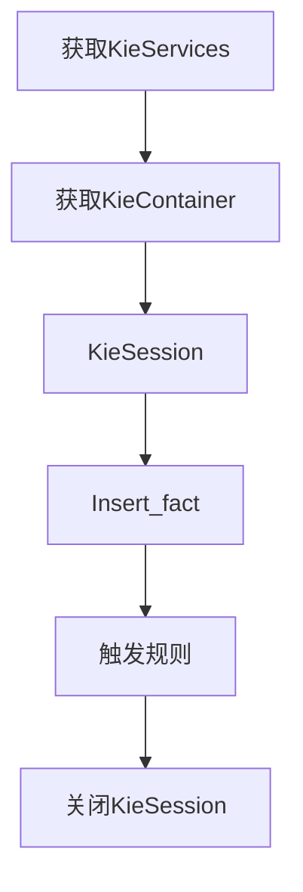

# Drools实战

## 一、Drools简介

Drools 是一款由JBoss组织提供的基于 Java 语言编写的开源规则引擎，可以将复杂且多变的业务规则从硬编码中解放出来，以规则脚本的形式存放在文件或特定的存储介质中（例如存放在数据库中），使用
Rete 算法对所编写的规则求值。

[Drools官网](https://drools.org/)  
[Drools源码](https://github.com/kiegroup/drools)

Drools 被分为两个主要的部分：编译和运行时。编译是将规则描述文件按 ANTLR 3 语法进行解析，对语法进行正确性的检查，然后产生一种中间结构“descr”，descr 用 AST
来描述规则。目前，Drools 支持四种规则描述文件，分别是：drl 文件、 xls 文件、brl 文件和 dsl 文件，其中，常用的描述文件是 drl 文件和 xls 文件，而 xls
文件更易于维护，更直观，更为被业务人员所理解。运行时是将 AST传到 PackageBuilder，由 PackagBuilder来产生 RuleBase，它包含了一个或多个 Package 对象。

## 二、Drools快速入门

在项目中使用Drools时，既可以单独使用，也可以整合Spring使用。如果单独使用只需要导入如下maven坐标即可：

```xml

<dependency>
    <groupId>org.drools</groupId>
    <artifactId>drools-compiler</artifactId>
    <!-- 最新版本 8.41.0.Final, 8.x 需要java 55版本，即jdk11 -->
    <version>${drools-version}</version>
</dependency>
```

Drools API开发步骤如下：



快速入门案例：

1、创建maven工程，导入 drools-compiler 依赖，本案例中使用 7.32.0.Final

2、在recourse目录下新建 META-INF 目录，创建 kmodule.xml 文件（即 recourse/META-INF/kmodule.xml）

```xml
<?xml version="1.0" encoding="UTF-8" ?>
<kmodule xmlns="http://www.drools.org/xsd/kmodule">
    <!--
        name: 指定kbase的名称，可以任意，但是需要唯一
        packages: 指定规则文件的目录，需要根据实际的项目结构来指定，否则无法加载到对应的规则文件
        default: 指定kbase的默认值，true表示默认，false表示非默认
    -->
    <kbase name="kbase1" packages="rules" default="true">
        <!--
            name: 指定session的名称，可以任意，但是需要唯一
            ksession: 指定session是否为默认
        -->
        <ksession name="ksession-rule" default="true"/>
    </kbase>
</kmodule>
```

3、在recourse目录下新建 rules 目录，创建一个 bookDiscount.drl 规则文件

```java
// package 后面的只是个逻辑概念，不是一定与规则文件所在目录相同，甚至可以写成abc
package rules;

// 引入用于Java与Drools通信的实体
import com.kingsley.entity.Order
import java.math.BigDecimal;

dialect  "mvel"

// 规则名可以任意，只要多个规则之间唯一即可
// 所购图书总价在100元以下的没有优惠
rule "bookDiscount1"
    when
        $order:Order(originalPrice < 100) // 模式匹配，到规则引擎中（工作内存）查找满足条件的Order对象，赋值给$order（固定写法）
    then
        $order.setActualPrice($order.getOriginalPrice());
        System.out.println("命中规则1，图书的原始价格为: " + $order.originalPrice);
end

// 所购图书总价在100元-200元之间，优惠20元
rule "bookDiscount2"
    when
        $order:Order(originalPrice >= 100 && originalPrice < 200) // 模式匹配，到规则引擎中（工作内存）查找满足条件的Order对象，赋值给$order（固定写法）
    then
        $order.setActualPrice($order.getOriginalPrice().subtract(BigDecimal.valueOf(20)));
        System.out.println("命中规则2，图书的原始价格为: " + $order.originalPrice);
end

// 所购图书总价在200元-300元之间，优惠50元
rule "bookDiscount3"
    when
        $order:Order(originalPrice >= 200 && originalPrice < 300) // 模式匹配，到规则引擎中（工作内存）查找满足条件的Order对象，赋值给$order（固定写法）
    then
        $order.setActualPrice($order.getOriginalPrice().subtract(BigDecimal.valueOf(50)));
        System.out.println("命中规则3，图书的原始价格为: " + $order.originalPrice);
end


// 所购图书总价在300元以上，优惠100元
rule "bookDiscount4"
    when
        $order:Order(originalPrice >= 300) // 模式匹配，到规则引擎中（工作内存）查找满足条件的Order对象，赋值给$order（固定写法）
    then
        $order.setActualPrice($order.getOriginalPrice().subtract(BigDecimal.valueOf(100)));
        System.out.println("命中规则4，图书的原始价格为: " + $order.originalPrice);
end

```

4、编写测试代码，这里使用junit单元测试

```java
package com.kingsley.drools;

import com.kingsley.entity.Order;
import org.junit.Test;
import org.kie.api.KieServices;
import org.kie.api.runtime.KieContainer;
import org.kie.api.runtime.KieSession;

import java.math.BigDecimal;

/**
 * 图书优惠Drools单元测试
 *
 * @author kingsley
 * @date 2024/1/23 00:42
 */
public class BookDiscountTest {

    @Test
    public void testMatchRule1() {
        commonest(BigDecimal.TEN);
    }

    @Test
    public void testMatchRule2() {
        commonest(BigDecimal.TEN.multiply(BigDecimal.TEN));
    }

    @Test
    public void testMatchRule3() {
        commonest(BigDecimal.TEN.multiply(BigDecimal.TEN).multiply(BigDecimal.valueOf(2)));
    }

    @Test
    public void testMatchRule4() {
        commonest(BigDecimal.TEN.multiply(BigDecimal.TEN).multiply(BigDecimal.valueOf(5)));
    }

    private void commonest(BigDecimal originalPrice) {
        // 获取KieServices
        KieServices kieServices = KieServices.get();
        // 获取KieContainer容器对象
        KieContainer kieContainer = kieServices.newKieClasspathContainer();
        // 从容器中获取默认Session对象，kmodule.xml 配置的 ksession-rule 设置成了默认，所以使用无参方法能获取到这个默认session
        KieSession session = kieContainer.newKieSession();

        // 创建fact对象
        Order order = new Order();
        order.setOriginalPrice(originalPrice);

        // insert fact
        session.insert(order);

        // 触发（激活）规则，由Drools框架自动进行规则匹配，如果规则匹配成功则执行规则中配置的逻辑
        session.fireAllRules();

        // 关闭session
        session.dispose();

        System.out.println("优惠后的实际价格为：" + order.getActualPrice());
    }
}
```

## 三、Drools规则引擎的构成

Drools规则引擎由三部分构成：

1. **Working Memory(工作内存)**： drools会从Working Memory中获取数据并和规则文件中定义的规则进行匹配，所以我们开发的应用程序只需要将我们的数据插入到Working
   Memory中，
   例如在测试代码中，我们通过session.insert(order)方法将Order对象插入到Working Memory中。
2. **Rule Base(规则库)**：我们在规则文件中定义的规则都会被加载到规则库中
3. **Inference Engine(推理引擎)**

其中Inference Engine又包括三部分：

1. **Pattern Matcher(匹配器)**：将Rule Base中的规则和Working Memory中的数据（也称为Fact）进行匹配，如果匹配成功，则将匹配到的规则加入到Agenda中
2. **Agenda**(议程)：用于存放通过Pattern Matcher匹配到的规则
3. **Execution Engine(执行引擎)**：执行引擎会从议程中取出匹配到的规则，并执行规则中的then部分的逻辑

> Fact：事实，是规则引擎中数据的载体，通常是一个对象，是业务代码与规则引擎之间的桥梁，规则引擎通过Fact来获取数据，然后通过规则来处理Fact。

如下是Drools规则引擎的结构图：


规则引擎执行过程：

1. 将初始数据Fact插入到Working Memory中
2. 使用Pattern Matcher匹配规则和Fact
3. 如果执行规则存在冲突，即同时存在多个规则匹配到Fact，则将冲突的规则放入冲突集合
4. 解决冲突，将激活的规则加入到Agenda中
5. 执行Agenda中的规则，重复步骤2-5，直到执行完所有规则

## 四、Drools基础语法

### 1、规则文件构成

在使用Drools时，非常重要的一个工作就是编写规则文件，规则文件的后缀名通常为.drl，drl是Drools Rule Language的缩写，一套完整的Drools规则文件内容构成如下：

| 关键字      | 描述                              |
|----------|---------------------------------|
| package  | 包名，只限于逻辑上的管理，同一包名下的查询或者函数可以直接调用 |
| import   | 用于导入类或者静态方法                     |
| global   | 全局变量                            |
| function | 自定义函数                           |
| query    | 查询                              |
| rule end | 规则体的开始和结束标志符                    |

Drools支持的规则文件除了.drl外，还有Excel文件类型的

### 2、规则体语法结构

规则体是Drools规则文件的重要部分，是进行业务规则判断、处理业务结果的部分，规则体语法结构如下：

```java
rule "规则名称"
    attributes
    when
        LHS
    then
        RHS
end
```

**rule**：关键字，规则体的开始标志符，后面跟规则名称  
**attributes**：规则属性，是rule与when之间的参数，为可选项  
**when**：关键字，规则体的条件部分，用于判断规则是否生效，如果条件成立，则执行then部分的逻辑  
**LHS**（Left Hand
Side）：左部条件，是when部分的条件，用于判断规则是否生效，它由零个或多个条件元素组成，如果LHS为空，则它将被视为true。如果条件成立，则执行then部分的逻辑  
**then**：关键字，规则体的处理部分，用于处理规则生效后的结果  
**RHS**（Right Hand Side）：是规则的后果或行动部分  
**end**：关键字，规则体的结束标志符，表示规则体的结束，必须与rule关键字配对使用

### 3、注释

Drools支持两种注释，一种是单行注释，另一种是多行注释，两种注释的语法与Java类中使用一致，如下：

```java
// 单行注释
rule "rule1"
    when
    then
        System.out.println("Hello World!");
end


/*
多行注释
*/
rule "rule2"
    when
    then
        System.out.println("Hello World!");
end
```

### 4、Pattern模式匹配

Pattern模式匹配的语法如下：绑定变量名：Object(Field约束)
其中绑定变量名可以省略，通常绑定变量名的命名一版建议以$开头，如果定义了绑定变量名，那么在then部分的逻辑中就可以通过绑定变量名来操作对应的Fact对象。
Field约束部分是需要返回true或者false的0个或多个条件表达式。

```java
// 所购图书总价在200元-300元之间，优惠50元
rule "bookDiscount3"
    when
        $order:Order(originalPrice >= 200 && originalPrice < 300) // 模式匹配，到规则引擎中（工作内存）查找满足条件的Order对象，赋值给$order（固定写法）
    then
        $order.setActualPrice($order.getOriginalPrice().subtract(BigDecimal.valueOf(50)));
        System.out.println("命中规则3，图书的原始价格为: " + $order.originalPrice);
end
```

通过上面的例子我们可以知道  
1、工作内存中必须存在Order这种类型的Fact对象——类型约束  
2、Fact对象的originalPrice必须大于等于200元——属性约束    
3、Fact对象的originalPrice必须小于300元——属性约束  
以上条件必须同时满足，当前规则才有可能被激活

**绑定变量即可用在对象上，也可以用在对象的属性上**

```java
// 所购图书总价在200元-300元之间，优惠50元
rule "bookDiscount3"
    when
        $order:Order($op:originalPrice >= 200 && originalPrice < 300) 
    then
        $order.setActualPrice($order.getOriginalPrice().subtract(BigDecimal.valueOf(50)));
        System.out.println("命中规则3，图书的原始价格为: " + $op);
end
```

**LHS部分还可以定义多个Pattern模式匹配，多个Pattern模式匹配可以使用逻辑运算符 and 或者 or 进行连接，也可以不写，默认是and。**

```java
// 所购图书总价在200元-300元之间，优惠50元
rule "bookDiscount3"
    when
        $order:Order($op:originalPrice >= 200 && originalPrice < 300) and
        $customer:Customer(age >= 18 && gender == 'male')
    then
        $order.setActualPrice($order.getOriginalPrice().subtract(BigDecimal.valueOf(50)));
        System.out.println("命中规则3，图书的原始价格为: " + $op);
end
```

### 5、比较操作符

Drools支持的比较操作符如下：

| 操作符          | 描述                               |
|--------------|----------------------------------|
| ==           | 等于                               |
| !=           | 不等于                              |
| <            | 小于                               |
| <=           | 小于等于                             |
| \>           | 大于                               |
| >=           | 大于等于                             |
| contains     | 检查Fact对象的属性值是否包含指定的值             |
| not contains | 检查Fact对象的属性值是否不包含指定的值            |
| memberOf     | 检查Fact对象的属性值是否在一个或多个集合中          |
| not memberOf | 检查Fact对象的属性值是否不在一个或多个集合中         |
| matches      | 检查Fact对象的属性值是否与提供的标准Java正则表达式匹配  |
| not matches  | 检查Fact对象的属性值是否与提供的标准Java正则表达式不匹配 |

语法：前6个操作符和Java的比较操作符一致

- **contains** ｜ **not contains** 语法结构  
  Object(Field[Collection/Array] contains value)
  Object(Field[Collection/Array] not contains value)

- **memberOf** ｜ **not memberOf** 语法结构  
  Object(Field memberOf value[Collection/Array])
  Object(Field not memberOf value[Collection/Array])

- **matches** ｜ **not matches** 语法结构  
  Object(Field matches "正则表达式")
  Object(Field not matches "正则表达式")

### 6、执行指定规则

使用Drools框架提供的规则过滤器，可以只执行指定的规则，不执行其他规则。

```java

    /**
     * Fire all Matches on the Agenda
     *
     * @param agendaFilter filters the Matches that may fire
     * @return returns the number of rules fired
     */
    int fireAllRules(AgendaFilter agendaFilter);
    
```


### 7、关键字

Drools的关键字分为：硬关键字和软关键字。
**硬关键字**：硬关键字是我们在规则文件中 定义包名 或者 规则名 时明确不能使用的，硬关键字一旦使用，编译器会报错。
**软关键字**：软关键字虽然可以使用的，但是不建议使用。
硬关键字包括：true、false、null
软关键字包括：lock-on-active、date-effective、date-expires、no-loop、auto-focus、activation-group、agenda-group、entry-point、duration、
package、import、dialect、salience、enabled、attributes、rule、extend、when、then、template、query、declare、function、global、
eval、not、in、or、and、exists、forall、accumulate、from、collect、action、reverse、result、end、over、init

### 8、Drools内置方法

规则文件的RHS部分的主要作用是通过插入、更新、删除操作工作内存中的Fact对象，来达到控制规则引擎执行的目的。Drools提供了一些内置的方法，可以使用这些内置方法来操作工作内存中的Fact对象。
操作完成后，规则引擎会重新进行相关规则的匹配，原来没有匹配成功的规则在我们修改数据完成后可能会匹配成功。 Drools内置的方法有：

- update
- insert
- retract

a. **update**的作用是更新工作内存中的Fact对象。

定义Fact实体

```java
package com.kingsley.entity;

import lombok.AllArgsConstructor;
import lombok.Data;
import lombok.NoArgsConstructor;

import java.io.Serializable;

/**
 * @author kingsley
 * @date 2024/2/21 23:08
 */
@Data
@NoArgsConstructor
@AllArgsConstructor
public class Student implements Serializable {

    private int age;

    private String name;

    public Student(int age) {
        this(age, age + "的学生");
    }

}

```

单元测试代码

```java
package com.kingsley.drools;

import lombok.extern.slf4j.Slf4j;
import org.junit.After;
import org.junit.Before;
import org.kie.api.KieServices;
import org.kie.api.runtime.KieContainer;
import org.kie.api.runtime.KieSession;

/**
 * @author kingsley
 * @date 2024/2/21 23:13
 */
@Slf4j
public abstract class BaseTest {

    protected KieSession session;

    @Before
    public void setUp() {
        // 获取KieServices
        KieServices kieServices = KieServices.get();
        // 获取KieContainer容器对象
        KieContainer kieContainer = kieServices.newKieClasspathContainer();
        // 从容器中获取默认Session对象，kmodule.xml 配置的 ksession-rule 设置成了默认，所以使用无参方法能获取到这个默认session
        session = kieContainer.newKieSession();
    }

    @After
    public void tearDown() {
        if (session != null) {
            session.dispose();
            session = null;
        }
    }
}

///////////////////////////////////////

package com.kingsley.drools;

import com.kingsley.entity.Student;
import org.drools.core.base.RuleNameStartsWithAgendaFilter;
import org.junit.Test;

/**
 * 内置方法单元测试
 *
 * @author kingsley
 * @date 2024/2/21 23:13
 */
public class InnerMethodTest extends BaseTest {

    @Test
    public void testUpdateInnerMethod() {
        Student student = new Student(5);
        session.insert(student);
        session.fireAllRules(new RuleNameStartsWithAgendaFilter("updateInnerMethod"));
    }
}
```

1. 调用set方法更新fact对象的情况  
   规则文件 updateInnerMethod.drl
    ```java
    package rules;
    dialect  "mvel"
    
    import com.kingsley.entity.Student
    import org.slf4j.Logger
    
    rule "updateInnerMethod-要求Student的age大于10岁并且小于20岁"
        when
            $s : Student(age > 10 && age <= 20)
        then
            Logger log = org.slf4j.LoggerFactory.getLogger("rule updateInnerMethod-要求Student的age大于10岁并且小于20岁");
            log.info("规则【要求Student的age大于10岁并且小于20岁】触发了...");
    end
    
    rule "updateInnerMethod-要求Student的age小于等于10岁"
        when
            $s : Student(age <= 10)
        then
            $s.setAge(15);
            Logger log = org.slf4j.LoggerFactory.getLogger("rule updateInnerMethod-要求Student的age小于等于10岁");
            log.info("规则【要求Student的age小于等于10岁】触发了...");
    end
    ```

   执行结果：
   > 2024-02-22 00:02:08.406 INFO rule updateInnerMethod-要求Student的age小于等于10岁 : 规则【要求Student的age小于等于10岁】触发了...

   <span style="color:red">说明调用set方法修改Fact对象的属性不会触发规则的重新匹配</span>

2. 调用update内置方法更新fact对象的情况
   修改规则文件——添加update($s)
    ```java
    package rules;
    dialect  "mvel"
    
    import com.kingsley.entity.Student
    import org.slf4j.Logger
    
    rule "updateInnerMethod-要求Student的age大于10岁并且小于20岁"
        when
            $s : Student(age > 10 && age <= 20)
        then
            Logger log = org.slf4j.LoggerFactory.getLogger("rule updateInnerMethod-要求Student的age大于10岁并且小于20岁");
            log.info("规则【要求Student的age大于10岁并且小于20岁】触发了...");
    end
    
    rule "updateInnerMethod-要求Student的age小于等于10岁"
        when
            $s : Student(age <= 10)
        then
            $s.setAge(15);
            update($s)
            Logger log = org.slf4j.LoggerFactory.getLogger("rule updateInnerMethod-要求Student的age小于等于10岁");
            log.info("规则【要求Student的age小于等于10岁】触发了...");
    end
    ```
   执行结果
   > 2024-02-22 00:02:36.555 INFO rule updateInnerMethod-要求Student的age小于等于10岁 : 规则【要求Student的age小于等于10岁】触发了...
   > 2024-02-22 00:02:36.565 INFO rule updateInnerMethod-要求Student的age大于10岁并且小于20岁 : 规则【要求Student的age大于10岁并且小于20岁】触发了...

<span style="color:red">说明调用内置方法update会触发规则的重新匹配，**并且与update方法的调用位置无关**</span>

需要注意的是：**如果调用update内置方法更新Fact对象的字段不恰当，可能会引起程序陷入死循环**

b. **insert**的作用是将一个Fact对象插入到工作内存中，并让相关的规则重新匹配。

1. 定义规则文件insertInnerMethod.drl

```java
package rules;
import org.slf4j.Logger
import com.kingsley.entity.Student
dialect  "mvel"

rule "insertInnerMethod-要求Student的age大于10岁并且小于20岁"
    when
        $s : Student(age > 10 && age <= 20)
    then
        Logger log = org.slf4j.LoggerFactory.getLogger("rule insertInnerMethod-要求Student的age大于10岁并且小于20岁");
        log.info("规则【要求Student的age大于10岁并且小于20岁】触发了...");
end

rule "insertInnerMethod-要求Student的age小于等于10岁"
    when
        $s : Student(age <= 10)
    then
        Student s = new Student(15);
        insert(s)
        org.slf4j.LoggerFactory.getLogger("rule insertInnerMethod-要求Student的age小于等于10岁").info("规则【要求Student的age小于等于10岁】触发了... 并且通过内置方法insert了一个15岁的Student");
end
```

2. 执行单元测试

```java
    @Test
    public void testInsertInnerMethod() {
        Student student = new Student(5);
        session.insert(student);
        session.fireAllRules(new RuleNameStartsWithAgendaFilter("insertInnerMethod"));
    }
```

3. 执行结果

> 2024-02-22 00:10:54.515 INFO rule insertInnerMethod-要求Student的age小于等于10岁 : 规则【要求Student的age小于等于10岁】触发了...
> 并且通过内置方法insert了一个15岁的Student   
> 2024-02-22 00:10:54.519 INFO rule insertInnerMethod-要求Student的age大于10岁并且小于20岁 : 规则【要求Student的age大于10岁并且小于20岁】触发了...

<span style="color:red">说明调用内置方法insert会覆盖已经存在的Fact对象，触发规则的重新匹配</span>

c. **retract**的作用是将一个Fact对象从工作内存中移除

1. 定义规则文件 retractInnerMethod.drl

```java
package rules;
import org.slf4j.Logger
import com.kingsley.entity.Student
dialect  "mvel"

rule "retractInnerMethod-要求Student的age小于10岁"
    when
        $s : Student(age<10)
    then
        Logger log = org.slf4j.LoggerFactory.getLogger("rule retractInnerMethod-要求Student的age小于10岁");
        log.info("规则【要求Student的age小于10岁】触发了...");
end

rule "retractInnerMethod-要求Student的age小于20岁"
    when
        $s : Student(age < 20)
    then
        retract($s)
        org.slf4j.LoggerFactory.getLogger("rule retractInnerMethod-要求Student的age小于20岁").info("规则【要求Student的age小于20岁】触发了... 并且通过内置方法retract删除了Student");
end
```

2. 执行单元测试

```java
    @Test
    public void testRetractInnerMethod() {
        Student student = new Student(5);
        session.insert(student);
        session.fireAllRules(new RuleNameStartsWithAgendaFilter("retractInnerMethod"));
    }
```

3. 执行结果

> 2024-02-22 00:23:31.252 INFO rule retractInnerMethod-要求Student的age小于10岁 : 规则【要求Student的age小于10岁】触发了...
> 2024-02-22 00:23:31.264 INFO rule retractInnerMethod-要求Student的age小于20岁 : 规则【要求Student的age小于20岁】触发了... 并且通过内置方法retract删除了Student
****

1. 如果调整删除Fact对象的位置

```java
package rules;
import org.slf4j.Logger
import com.kingsley.entity.Student
dialect  "mvel"

rule "retractInnerMethod-要求Student的age小于20岁"
    when
        $s : Student(age < 20)
    then
        retract($s)
        org.slf4j.LoggerFactory.getLogger("rule retractInnerMethod-要求Student的age小于20岁").info("规则【要求Student的age小于20岁】触发了... 并且通过内置方法retract删除了Student");
end

rule "retractInnerMethod-要求Student的age小于10岁"
    when
        $s : Student(age<10)
    then
        Logger log = org.slf4j.LoggerFactory.getLogger("rule retractInnerMethod-要求Student的age小于10岁");
        log.info("规则【要求Student的age小于10岁】触发了...");
end
```

2. 执行结果会变成

> 2024-02-22 00:28:08.894 INFO rule retractInnerMethod-要求Student的age小于20岁 : 规则【要求Student的age小于20岁】触发了... 并且通过内置方法retract删除了Student

这是因为Drools默认是按照drl文件中的顺序执行规则，所以当执行retract方法时，执行到【retractInnerMethod-要求Student的age小于10岁】时已经没有Student对象了，所以规则不会触发。
可以通过 salience 属性来配置规则的优先级，Drools默认规则的优先级是0，salience 属性的值越大，优先级越高，规则的执行顺序就靠前。
****
如果设置规则的优先级

```java
package rules;
import org.slf4j.Logger
import com.kingsley.entity.Student
dialect  "mvel"

rule "retractInnerMethod-要求Student的age小于20岁"
    when
        $s : Student(age < 20)
    then
        retract($s)
        org.slf4j.LoggerFactory.getLogger("rule retractInnerMethod-要求Student的age小于20岁").info("规则【要求Student的age小于20岁】触发了... 并且通过内置方法retract删除了Student");
end

rule "retractInnerMethod-要求Student的age小于10岁"
    salience 10
    when
        $s : Student(age<10)
    then
        Logger log = org.slf4j.LoggerFactory.getLogger("rule retractInnerMethod-要求Student的age小于10岁");
        log.info("规则【要求Student的age小于10岁】触发了...");
end
```

则执行结果会变成
> 2024-02-22 00:34:47.903 INFO rule retractInnerMethod-要求Student的age小于10岁 : 规则【要求Student的age小于10岁】触发了...   
> 2024-02-22 00:34:47.908 INFO rule retractInnerMethod-要求Student的age小于20岁 : 规则【要求Student的age小于20岁】触发了... 并且通过内置方法retract删除了Student

因为【retractInnerMethod-要求Student的age小于10岁】的优先级10比【retractInnerMethod-要求Student的age小于20岁】的0高，
所以会先触发【retractInnerMethod-要求Student的age小于10岁】， 然后才触发【retractInnerMethod-要求Student的age小于20岁】。

<span style="color:red">说明调用内置方法retract会将一个Fact对象从工作内存中移除，会影响优先级更低的规则的命中</span>

## 五、规则属性

前面我们已经知道了Drools规则体的构成如下：

```text
rule "规则名称"
    attributes
    when
        LHS
    then
        RHS
end
```

attributes即为规则属性，本章节将介绍Drools部分规则属性的使用。

| 属性名              | 说明                        |
|------------------|---------------------------|
| salience         | 指定规则的优先级                  |
| dialect          | 指定规则使用的语言类型，取值为：mvel、java |
| enabled          | 指定规则是否启用，默认值为true         |
| date-effective   | 指定规则生效时间                  |
| date-expires     | 指定规则失效时间                  |
| no-loop          | 防止死循环                     |
| auto-focus       | 自动聚焦，一般结合agenda-group使用   |
| agenda-group     | 议程分组，只有获取焦点的规则才有可能触发      |
| activation-group | 激活分组，具有相同分组名称的规则只能有一个规则触发 | 
| timer            | 定时器，用于指定规则触发的时间间隔         |

#### 1、enabled属性

