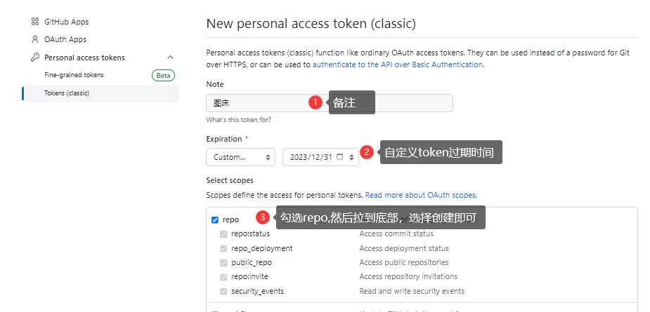

---

---

# 如何基于GitHub搭建自己的图床？

## 一、图床的概念

> 简单来说：图床就是存储图片的服务器。  

- **由来**：通常我们的图片都是保存在本地，比如我们常用Typora写的笔记，里面的图片都默认保存在本地，这时候我们如果把对应的笔记发给别人，那么笔记的图片也要跟着发过去（同时确保图片的路径是对的），这样别人才能完整查看到我们的笔记。
- **问题**：老是要传来传去的，这样很麻烦。
- **解决**：这时候我们想到如果把图片放在互联网上，这时候任何人都可以看见并且能下载，就完美解决了。那么我们把别人也可以访问到图片的服务器叫做图床。

## 二、用GitHub创建
gitee也可以搭建图床，但不推荐使用，限制比较多。
> 步骤：  
> 1）新建仓库  
> 2）生成Token令牌  
> 3）创建img分支和该分支下的img文件夹(可选)  

### 1、新建仓库

点击+号 -> New repository -> 填写相关信息 -> Create repository

> 如需使用jsDelivr cdn加速，则必须使用公开库，私有库不支持
> 留意分支 master

### 2、生成Token令牌

- 点击右上角头像 -> Settings -> 下拉，直到左侧到底，
- 选择Developer settings(开发人员设置) -> Personal Access tokens(个人访问令牌) -> Tokens(classic)
- Generate New Token(classic， 一定要选择 classic 方式) -> 配置相关信息 -> Generate token

Token令牌用于个人身份验证，不需要密码也可以直接访问你的仓库内容。

> 在创建页面中，填写 Note 为“图床”，Expiration（过期时间）为 No expiration（永久）,也可以自定义过期时间，在下面的Select scopes（选择权限范围）如下图勾选 repo，最后点击 generate token 生成令牌即可。

> 务必将令牌保存起来，放在一个安全的地方，页面关掉后就看不到了。

### 3、使用PicGo上传图片
#### 下载PicGo软件
> PicGo是一个用于上传图片的客户端，支持拖拽上传、剪贴板上传，功能十分方便。

- [PicGo官网](https://molunerfinn.com/PicGo/)
- [PicGo的Github地址](https://github.com/Molunerfinn/picgo/releases)
- [山东大学PicGo镜像地址](https://mirrors.sdu.edu.cn/github-release/Molunerfinn_PicGo/v2.3.1/)

#### 配置PicGo

选择图床设置 -> Github，这里需要配置GitHub仓库地址、分支名、AccessToken等基础信息。
- 仓库名：GitHub用户名/GitHub仓库地址
- 分支名：GitHub的分支名称
- Token：GitHub中设定的AccessToken
- 存储路径：最后一定要加上 /，例如 img/
- 自定义域名：[https://fastly.jsdelivr.net/gh/用户名/仓库名](https://fastly.jsdelivr.net/gh/用户名/仓库名) 或 [https://cdn.jsdelivr.net/gh/用户名/仓库名](https://cdn.jsdelivr.net/gh/用户名/仓库名) 这样才可以通过cdn访问图片
> CDN有时候不好使

#### 用PicGo实现上传
直接拖拽上传即可

上传完成会在相册中查看到或者直接在GitHub仓库中查看

#### 4、Typora实现自动上传

> Typora是Markdown编辑器，支持拖拽上传图片，自动上传到图床。

- Windows：文件 -> 偏好设置 -> 图像 -> 上传图片 -> 配置PicGo路径
- MacOS：Typora -> 设置 -> 图像 -> 上传图片 -> 配置PicGo路径

